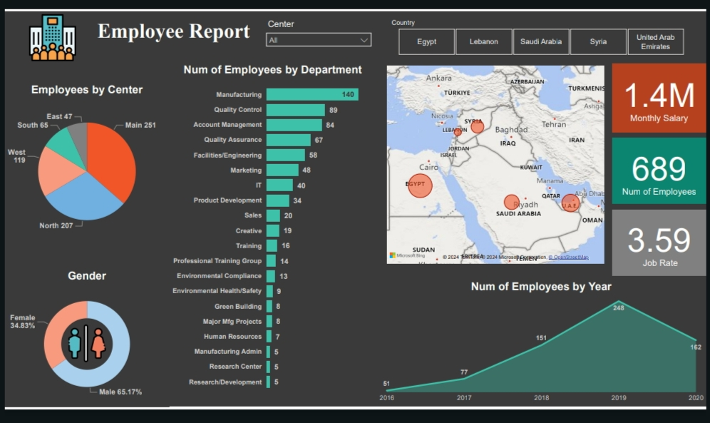

# 👩‍💼 Employee Analysis Dashboard Project  

## 🔎 Introduction  
Welcome to the **Employee Analysis Dashboard Project**, where we use Power BI to deliver key insights about employee performance, demographics, and organizational trends. This project demonstrates the power of data visualization in human resource analytics.  

---

## 🖼️ Overview  
Below is a snapshot of the interactive Power BI dashboard created for this project:  

  

You can view the full post and discussion on LinkedIn here:  
[Employee Dashboard on LinkedIn](https://www.linkedin.com)  

---

## 🎯 Objective  
- To understand workforce demographics and their distribution.  
- To analyze employee performance across departments.  
- To identify trends in employee engagement and satisfaction.  

---

## 🔍 Scope of Analysis  
1. **Employee Demographics:** Gender, age group, and departmental distribution.  
2. **Performance Metrics:** Productivity, project completion, and targets achieved.  
3. **Engagement Trends:** Attendance, participation, and satisfaction scores.  
4. **Departmental Insights:** Comparing metrics across different teams and departments.  

---

## 🛠️ Technology and Tools  
- **Visualization Tool:** Power BI  
- **Data Source:** Employee data from internal HR systems or external benchmarks  
- **Techniques:** Exploratory Data Analysis (EDA), comparative analysis, and visual storytelling.  

---

## 📊 Insights Uncovered  
- **Gender Distribution:** Balanced representation across teams.  
- **Top Performing Department:** Highest productivity seen in Sales & Marketing.  
- **Engagement Scores:** Average satisfaction rating of 7.8/10 with variation across teams.  
- **Key Bottlenecks:** Areas identified for improvement in team collaboration.  

---

## 💡 Insights and Recommendations  
1. **Promote Employee Recognition:** Regular rewards for top-performing departments.  
2. **Focus on Engagement:** Invest in team-building activities for departments with low satisfaction scores.  
3. **Optimize Resource Allocation:** Address bottlenecks in collaboration for better productivity.  
4. **Enhance Reporting Systems:** Automate performance tracking for real-time feedback.  

---

## 📩 Contact  
💼 Created by **Shimaa Alaa**  
📧 Email: shimaaalaagomaa@gmail.com  
🔗 [LinkedIn Profile](https://www.linkedin.com/in/shimaa-alaa5) 

